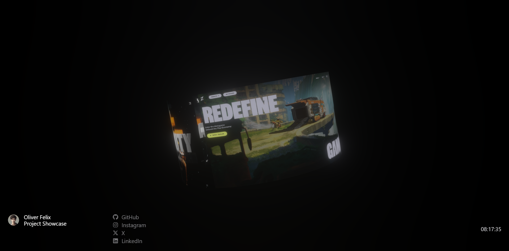

# Cylinder Showcase



**Cylinder Showcase** is a 3D interactive web application built with **React Three Fiber (R3F)**, designed to display and animate a rotating cylindrical object with textured surfaces. The project demonstrates the power of **Three.js**, post-processing effects, and responsive camera control.

## 🚀 Live Demo

🔗 **Visit here:** [Cylinder Showcase](https://cylindershowcase.vercel.app/)

## 📂 Project Overview

- **Technologies Used:**
  - React.js
  - React Three Fiber (R3F)
  - Three.js
  - @react-three/drei
  - @react-three/postprocessing
  - Tailwind CSS (for UI elements)

- **Features:**
  - 🌀 **Rotating Cylinder:** A dynamically rotating 3D cylinder with a custom texture.
  - 🌟 **Post-Processing Effects:** Bloom effects for enhanced visuals.
  - 🎥 **Adaptive Camera FOV:** Automatically adjusts based on screen size for a responsive experience.
  - 🌐 **Optimized Performance:** Efficient rendering with React Three Fiber.
  
## 🛠️ Installation & Setup

Clone the repository and install dependencies:

```sh
git clone https://github.com/oliverfelixdev/cylindershowcase.git
cd cylindershowcase
npm install
```

### Run the development server:
```sh
npm run dev
```
Then open `http://localhost:5173/` in your browser.

## 🔧 Usage

- Hover over the 3D cylinder to view the interactive showcase.
- The animation runs automatically, creating a smooth rotating effect.
- Social media and project links are displayed at the bottom.

## 📜 License

This project is open-source under the **MIT License**.

## 💬 Connect with Me

- 🐙 **GitHub:** [@oliverfelixdev](https://github.com/oliverfelixdev)
- 🔗 **LinkedIn:** [Oliver Felix](https://www.linkedin.com/in/oliverfelixdev)
- 🎨 **Instagram:** [@oliverfelix.dev](https://www.instagram.com/oliverfelix.dev)

Feel free to **star** ⭐ this repo if you find it useful! 🚀

